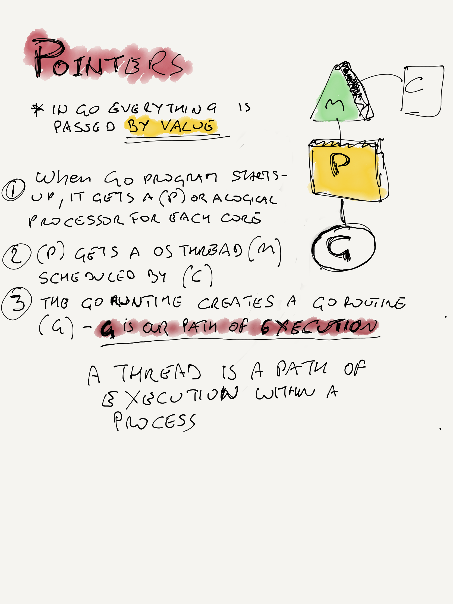

In Go, everything is passed by value.

```
func zero(x int) {
  x = 0
}
func main() {
  x := 5
  zero(x)
  fmt.Println(x) // x is still 5
}
```

If you want to modify a variable across function boundaries, use pointers.

A pointer is a variable which stores the memory address of another variable.


